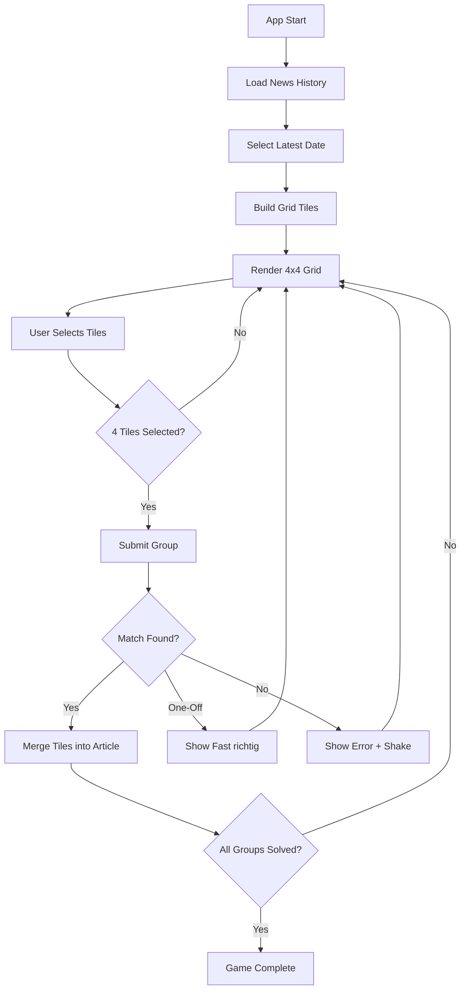
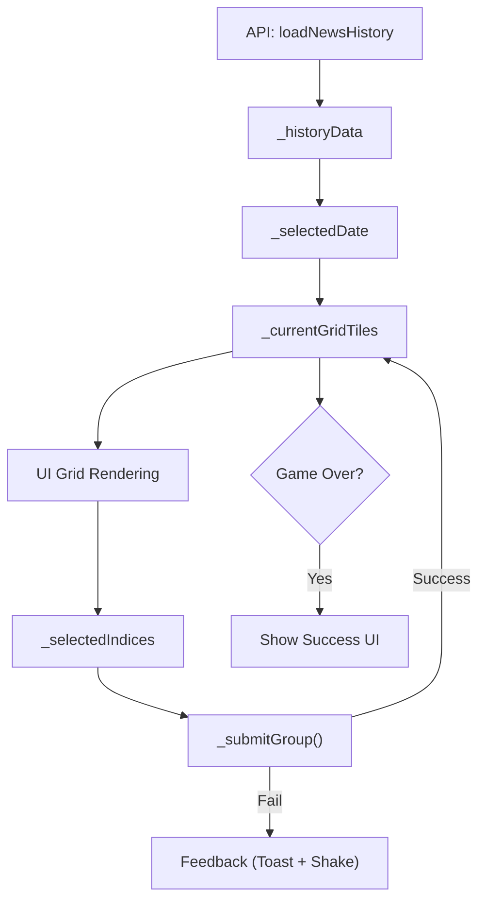
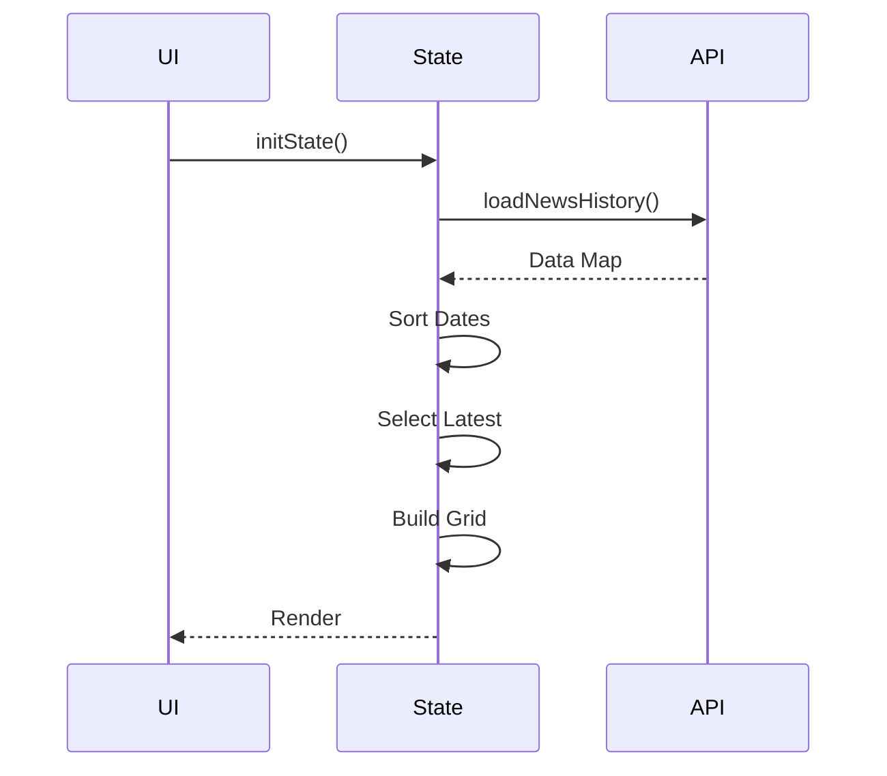
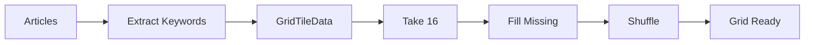
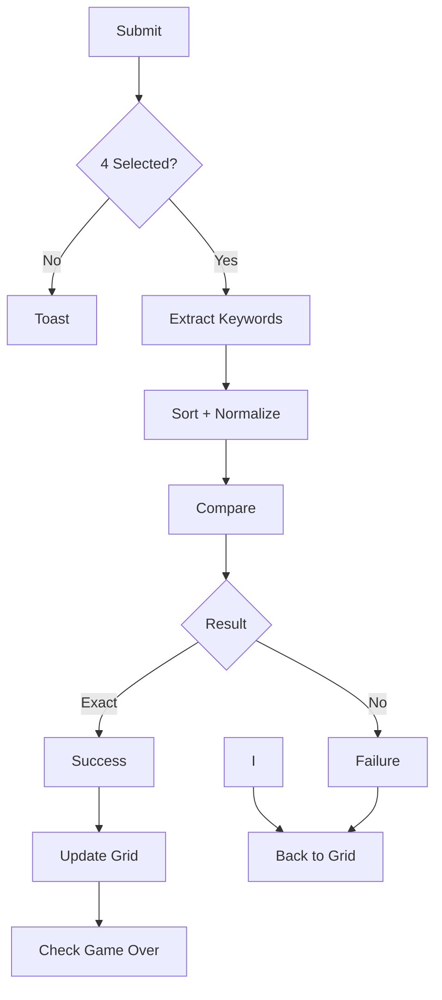
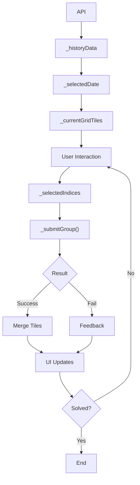

# TAGESSCHLAU – Architecture & State Flow Documentation

This document explains how data, state, and user interactions flow through the application. It is intended to give a clear mental model of how the game works internally.

---

# 1. High-Level Overview

The app is a **daily puzzle game** where users group 16 keywords into 4 correct groups. Each group corresponds to a news article.

### Core flow:


---

# 2. Data Layer

## `ApiHelper.loadNewsHistory()`

* Returns:

```dart
Map<DateTime, List<NewsModel>>
```

### Structure:

* **Key**: Date
* **Value**: List of `NewsModel` objects

---

## `NewsModel`

Each article contains:

* `title`
* `imageURL`
* `shareURL`
* `keywords` (List<String>, always 4 per article)

---

# 3. State Management

All state is handled inside:

```
_ConnectionsScreenState
```

### Core State Variables

#### Data

```dart
Map<DateTime, List<NewsModel>>? _historyData;
DateTime? _selectedDate;
```

#### Game Grid

```dart
List<GridTileData> _currentGridTiles;
Set<int> _selectedIndices;
```

#### UI / Game State

```dart
bool _isLoading;
int _attempts;
bool _animateTiles;
```

#### Animation / Feedback

```dart
OverlayEntry? _currentToast;
AnimationController _shakeController;
```

### State Flow

---

# 4. GridTileData Model

Represents a single tile in the grid.

```dart
class GridTileData {
  List<String> keywords;
  NewsModel? article;
  bool isMerged;
  bool isNew;
}
```

### Meaning of fields:

| Field      | Purpose                      |
| ---------- | ---------------------------- |
| `keywords` | Display text                 |
| `article`  | Attached when tile is merged |
| `isMerged` | Whether tile is solved       |
| `isNew`    | Triggers pop animation       |

---

# 5. App Initialization Flow

## `initState()`

1. Initialize shake animation controller
2. Call `_initData()`

---

## `_initData()`



Steps:

1. Fetch data from API
2. Sort dates descending
3. Select latest date
4. Call `_updateActiveDate()`
5. Disable loading spinner

---

# 6. Date Switching Flow

## `_showDateSelector()`

1. Opens date picker
2. User selects a date
3. Matches selected date with available data
4. Calls:

```
_updateActiveDate(date)
```

---

## `_updateActiveDate(date)`

This is the **main reset function**.

### It:

* Clears selections
* Resets attempts
* Builds a fresh grid

### Grid Creation:



Then:

```
_prefetchImages()
```

---

# 7. Image Prefetching

## `_prefetchImages()`

* Iterates over articles
* Preloads images into cache

Purpose:

* Prevent flickering when merged tiles appear

---

# 8. User Interaction Flow

## Tile Tap

### If tile is NOT merged:

* Toggle selection
* Max 4 selections allowed

### If tile IS merged:

* Opens article via `_openArticle()`

---

# 9. Submission Logic

## `_submitGroup()`



#### Outcomes:

| Condition   | Result  |
| ----------- | ------- |
| Exact match | SUCCESS |
| 3/4 match   | ONE-OFF |
| Otherwise   | FAIL    |

---

### Success Flow

1. Remove selected tiles
2. Insert merged tile

```dart
GridTileData(
  keywords: article.keywords,
  isMerged: true,
  article: article,
  isNew: true
)
```

3. Disable animation temporarily
4. Re-enable after frame
5. Reset `isNew`

---

### Failure Flow

* Trigger shake animation
* Increment `_attempts`
* Show toast:

    * "Fast richtig! (3 von 4)"
    * or "Falsche Gruppe"

---

# 10. Grid Layout System

## `_buildAnimatedTiles()`

Responsible for:

* Positioning tiles
* Handling animation

---

### Layout Logic

#### Merged Tiles:

* Always full width
* Stack vertically at top

#### Unmerged Tiles:

* Fill remaining rows
* 4 columns grid

---

### Position Calculation

```dart
top = row * rowHeight
left = col * (tileWidth + spacing)
```

---

### Animation

Uses:

```dart
AnimatedPositioned
```

Controlled by:

```dart
_animateTiles
```

---

# 11. Tile Rendering

## `_buildTile()`

Handles:

* Tap interaction
* Scale animation
* Styling

---

### States:

| State    | Behavior        |
| -------- | --------------- |
| Normal   | Keyword text    |
| Selected | Dark background |
| Merged   | Image + overlay |

---

## Merged Tile Content

Displays:

* Article title
* Keywords
* Background image

---

## Unmerged Tile Content

Displays:

* Single keyword
* Responsive text scaling

---

# 12. Animations

## Pop Animation

Triggered by:

```dart
isNew = true
```

Implemented with:

```
TweenAnimationBuilder (scale)
```

---

## Shake Animation

Triggered on wrong submission.

Uses:

```
_ShakeTransition
→ sine wave translation
```

---

# 13. Shuffle Logic

## `_shuffleTiles()`

* Keeps merged tiles fixed
* Shuffles only unmerged tiles

```dart
_currentGridTiles = [...merged, ...unmerged]
```

---

# 14. Game Completion

## `_isGameOver`

```dart
all tiles.isMerged == true
```

---

### UI Reaction:

* Show success message:

```
Gelöst in X Versuchen!
```

* Hide action buttons

---

# 15. Bottom Controls

### Buttons:

| Button           | Action          |
| ---------------- | --------------- |
| Mischen          | Shuffle tiles   |
| Auswahl aufheben | Clear selection |
| Bestätigen       | Submit group    |

---

# 16. Toast System

## `_showMessage()`

* Uses `OverlayEntry`
* Displays temporary messages
* Auto fades out after ~2 seconds

---

# 17. External Navigation

## `_openArticle(url)`

* Opens link using `url_launcher`
* Uses external browser

---

# 18. State Flow Summary



---

# 19. Key Design Principles

### Deterministic Game Logic

* All validation is based on sorted keyword comparison

### UI-State Separation

* Grid state is fully derived from `_currentGridTiles`

### Immutable-Like Updates

* Lists rebuilt instead of mutated unpredictably

### Animation Safety

* `_animateTiles` prevents layout glitches during merges

---

# 20. Mental Model

Think of the app as:

```
DATA (articles)
→ TRANSFORM (keywords → tiles)
→ INTERACTION (selection)
→ VALIDATION (group matching)
→ TRANSFORMATION (merge tiles)
→ LOOP
```

---

If you understand:

* `_currentGridTiles`
* `_selectedIndices`
* `_submitGroup()`

…you understand the entire app.

---
