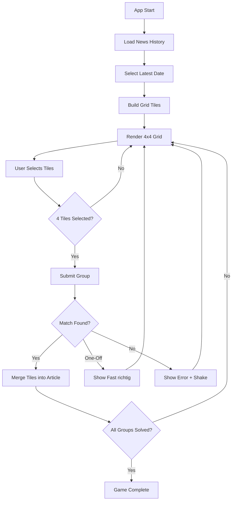
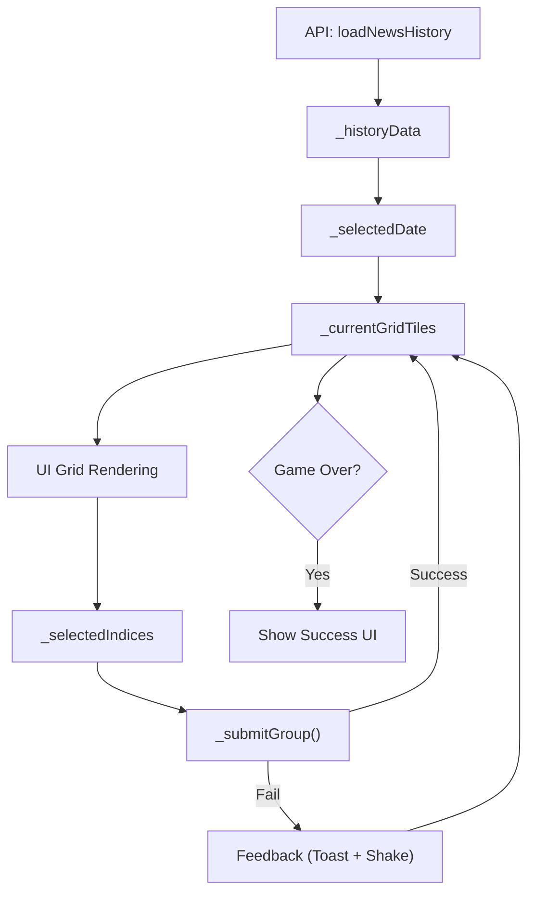
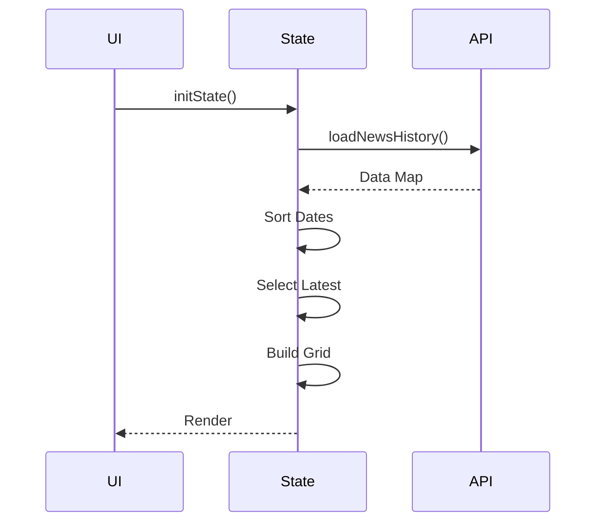
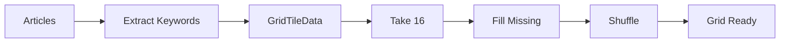
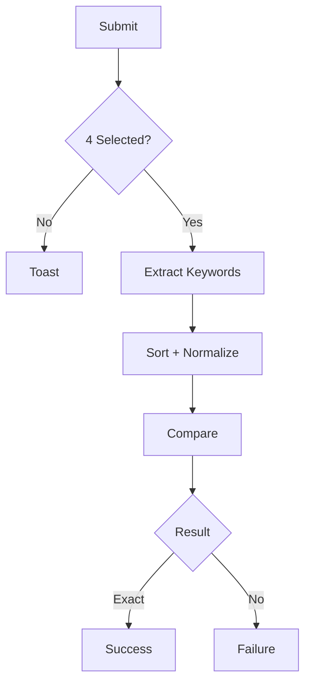
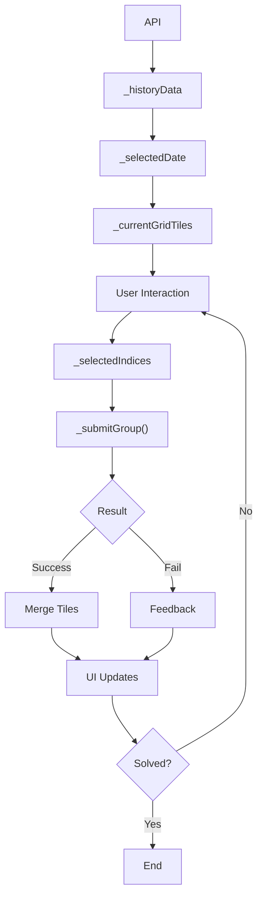

# TAGESSCHLAU – Architecture & State Flow Documentation

This document explains how data, state, and user interactions flow through the application. It is intended to give a clear mental model of how the game works internally.

---

# 1. High-Level Overview

The app is a **daily puzzle game** where users group 16 keywords into 4 correct groups. Each group corresponds to a news article.

### Core flow:


```mermaid
flowchart TD
    A[App Start] --> B[Load News History]
    B --> C[Select Latest Date]
    C --> D[Build Grid Tiles]
    D --> E[Render 4x4 Grid]

    E --> F[User Selects Tiles]
    F --> G{4 Tiles Selected?}

    G -- No --> E
    G -- Yes --> H[Submit Group]

    H --> I{Match Found?}

    I -- Yes --> J[Merge Tiles into Article]
    I -- One-Off --> K["Show Fast richtig"]
    I -- No --> L[Show Error + Shake]

    J --> M{All Groups Solved?}
    M -- No --> E
    M -- Yes --> N[Game Complete]

    K --> E
    L --> E
```
---

# 2. Data Layer

## `ApiHelper.loadNewsHistory()`

* Returns:

```dart
Map<DateTime, List<NewsModel>>
```

### Structure:

* **Key**: Date
* **Value**: List of `NewsModel` objects

---

## `NewsModel`

Each article contains:

* `title`
* `imageURL`
* `shareURL`
* `keywords` (List<String>, always 4 per article)

---

# 3. State Management

All state is handled inside:

```
_ConnectionsScreenState
```

### Core State Variables

#### Data

```dart
Map<DateTime, List<NewsModel>>? _historyData;
DateTime? _selectedDate;
```

#### Game Grid

```dart
List<GridTileData> _currentGridTiles;
Set<int> _selectedIndices;
```

#### UI / Game State

```dart
bool _isLoading;
int _attempts;
bool _animateTiles;
```

#### Animation / Feedback

```dart
OverlayEntry? _currentToast;
AnimationController _shakeController;
```

### State Flow

```mermaid
flowchart TD
  API[API: loadNewsHistory] --> H[_historyData]

  H --> D[_selectedDate]
  D --> G[_currentGridTiles]

  G --> UI[UI Grid Rendering]

  UI --> S[_selectedIndices]

  S --> SUB["_submitGroup()"]

SUB -->|Success| G
SUB -->|Fail| FB["Feedback (Toast + Shake)"]
FB --> G

G --> END{Game Over?}
END -->|Yes| DONE[Show Success UI]
```
---

# 4. GridTileData Model

Represents a single tile in the grid.

```dart
class GridTileData {
  List<String> keywords;
  NewsModel? article;
  bool isMerged;
  bool isNew;
}
```

### Meaning of fields:

| Field      | Purpose                      |
| ---------- | ---------------------------- |
| `keywords` | Display text                 |
| `article`  | Attached when tile is merged |
| `isMerged` | Whether tile is solved       |
| `isNew`    | Triggers pop animation       |

---

# 5. App Initialization Flow

## `initState()`

1. Initialize shake animation controller
2. Call `_initData()`

---

## `_initData()`


```mermaid
sequenceDiagram
    participant UI
    participant State
    participant API

    UI->>State: initState()
    State->>API: loadNewsHistory()
    API-->>State: Data Map

    State->>State: Sort Dates
    State->>State: Select Latest
    State->>State: Build Grid

    State-->>UI: Render
```

Steps:

1. Fetch data from API
2. Sort dates descending
3. Select latest date
4. Call `_updateActiveDate()`
5. Disable loading spinner

---

# 6. Date Switching Flow

## `_showDateSelector()`

1. Opens date picker
2. User selects a date
3. Matches selected date with available data
4. Calls:

```
_updateActiveDate(date)
```

---

## `_updateActiveDate(date)`

This is the **main reset function**.

### It:

* Clears selections
* Resets attempts
* Builds a fresh grid

### Grid Creation:


```mermaid
flowchart LR
  A[Articles] --> B[Extract Keywords]
  B --> C[GridTileData]
  C --> D[Take 16]
  D --> E[Fill Missing]
  E --> F[Shuffle]
  F --> G[Grid Ready]
```

Then:

```
_prefetchImages()
```

---

# 7. Image Prefetching

## `_prefetchImages()`

* Iterates over articles
* Preloads images into cache

Purpose:

* Prevent flickering when merged tiles appear

---

# 8. User Interaction Flow

## Tile Tap

### If tile is NOT merged:

* Toggle selection
* Max 4 selections allowed

### If tile IS merged:

* Opens article via `_openArticle()`

---

# 9. Submission Logic

## `_submitGroup()`


```mermaid
flowchart TD
    A[Submit] --> B{4 Selected?}

    B -- No --> C[Toast]

    B -- Yes --> D[Extract Keywords]
    D --> E[Sort + Normalize]
    E --> F[Compare]

    F --> G{Result}

    G -- Exact --> H[Success]
    G -- No --> J[Failure]

```

#### Outcomes:

| Condition   | Result  |
| ----------- | ------- |
| Exact match | SUCCESS |
| 3/4 match   | ONE-OFF |
| Otherwise   | FAIL    |

---

### Success Flow

1. Remove selected tiles
2. Insert merged tile

```dart
GridTileData(
  keywords: article.keywords,
  isMerged: true,
  article: article,
  isNew: true
)
```

3. Disable animation temporarily
4. Re-enable after frame
5. Reset `isNew`

---

### Failure Flow

* Trigger shake animation
* Increment `_attempts`
* Show toast:

    * "Fast richtig! (3 von 4)"
    * or "Falsche Gruppe"

---

# 10. Grid Layout System

## `_buildAnimatedTiles()`

Responsible for:

* Positioning tiles
* Handling animation

---

### Layout Logic

#### Merged Tiles:

* Always full width
* Stack vertically at top

#### Unmerged Tiles:

* Fill remaining rows
* 4 columns grid

---

### Position Calculation

```dart
top = row * rowHeight
left = col * (tileWidth + spacing)
```

---

### Animation

Uses:

```dart
AnimatedPositioned
```

Controlled by:

```dart
_animateTiles
```

---

# 11. Tile Rendering

## `_buildTile()`

Handles:

* Tap interaction
* Scale animation
* Styling

---

### States:

| State    | Behavior        |
| -------- | --------------- |
| Normal   | Keyword text    |
| Selected | Dark background |
| Merged   | Image + overlay |

---

## Merged Tile Content

Displays:

* Article title
* Keywords
* Background image

---

## Unmerged Tile Content

Displays:

* Single keyword
* Responsive text scaling

---

# 12. Animations

## Pop Animation

Triggered by:

```dart
isNew = true
```

Implemented with:

```
TweenAnimationBuilder (scale)
```

---

## Shake Animation

Triggered on wrong submission.

Uses:

```
_ShakeTransition
→ sine wave translation
```

---

# 13. Shuffle Logic

## `_shuffleTiles()`

* Keeps merged tiles fixed
* Shuffles only unmerged tiles

```dart
_currentGridTiles = [...merged, ...unmerged]
```

---

# 14. Game Completion

## `_isGameOver`

```dart
all tiles.isMerged == true
```

---

### UI Reaction:

* Show success message:

```
Gelöst in X Versuchen!
```

* Hide action buttons

---

# 15. Bottom Controls

### Buttons:

| Button           | Action          |
| ---------------- | --------------- |
| Mischen          | Shuffle tiles   |
| Auswahl aufheben | Clear selection |
| Bestätigen       | Submit group    |

---

# 16. Toast System

## `_showMessage()`

* Uses `OverlayEntry`
* Displays temporary messages
* Auto fades out after ~2 seconds

---

# 17. External Navigation

## `_openArticle(url)`

* Opens link using `url_launcher`
* Uses external browser

---

# 18. State Flow Summary


```mermaid
flowchart TD
    A[API] --> B[_historyData]
    B --> C[_selectedDate]
    C --> D[_currentGridTiles]

    D --> E[User Interaction]
    E --> F[_selectedIndices]
    F --> G["_submitGroup()"]

    G --> H{Result}
    H -- Success --> I[Merge Tiles]
    H -- Fail --> J[Feedback]

    I --> K[UI Updates]
    J --> K

    K --> L{Solved?}
    L -- No --> E
    L -- Yes --> M[End]
```

---

# 19. Key Design Principles

### Deterministic Game Logic

* All validation is based on sorted keyword comparison

### UI-State Separation

* Grid state is fully derived from `_currentGridTiles`

### Immutable-Like Updates

* Lists rebuilt instead of mutated unpredictably

### Animation Safety

* `_animateTiles` prevents layout glitches during merges

---

# 20. Mental Model

Think of the app as:

```
DATA (articles)
→ TRANSFORM (keywords → tiles)
→ INTERACTION (selection)
→ VALIDATION (group matching)
→ TRANSFORMATION (merge tiles)
→ LOOP
```

---

If you understand:

* `_currentGridTiles`
* `_selectedIndices`
* `_submitGroup()`

…you understand the entire app.

---
# Backend

Das Backend besteht aus vier Python-Skripten im Ordner `backend/`. Es erzeugt aus aktuellen Tagesschau-Artikeln tägliche Keyword-Sets, speichert diese historisch in einer JSON-Datei und stellt die Historie über einen kleinen HTTP-Server für die App bereit.

## Überblick

1. Eine Worthäufigkeits-CSV wird heruntergeladen und entpackt.
2. [`idf_map_builder.py`](backend/idf_map_builder.py) erzeugt daraus eine `idf_map.csv`.
3. [`build_news_keywords.py`](backend/build_news_keywords.py) lädt die neuesten Artikel von der Tagesschau-API und bestimmt pro Artikel 4 Keywords.
4. [`update_news_history.py`](backend/update_news_history.py) schreibt das Tagesergebnis in `news_history.json`.
5. [`serve_news_history.py`](backend/serve_news_history.py) liefert diese Datei über `/history` an die App aus.

## Dateien im Backend

- [`backend/idf_map_builder.py`](backend/idf_map_builder.py): Baut aus einer CSV mit den Spalten `word` und `freq` eine IDF-Tabelle.
- [`backend/build_news_keywords.py`](backend/build_news_keywords.py): Holt Daten von `https://www.tagesschau.de/api2u/homepage`, filtert Artikel und berechnet Keywords.
- [`backend/update_news_history.py`](backend/update_news_history.py): Schreibt für das aktuelle Datum einen neuen Eintrag in `news_history.json`.
- [`backend/serve_news_history.py`](backend/serve_news_history.py): Startet einen HTTP-Server auf Port `9100` und liefert `news_history.json` unter `/history`.

## Wie die Skripte arbeiten

[`build_news_keywords.py`](backend/build_news_keywords.py) arbeitet in mehreren Schritten:

- Es lädt die Daten vom Tagesschau-Endpunkt `homepage`.
- Es ignoriert Einträge mit dem Tag `liveblog`.
- Es sortiert die Artikel nach Datum und nimmt die 4 neuesten Artikel.
- Es extrahiert aus dem Content nur Text- und Headline-Blöcke.
- Es verwendet spaCy mit dem Modell `de_core_news_sm`, um nur Nomen und Eigennamen zu behalten.
- Es entfernt Stopwörter und sehr kurze Begriffe.
- Es berechnet mit der zuvor erzeugten `idf_map.csv` einen Score pro Wort.
- Es wählt pro Artikel bis zu 4 Keywords aus und vermeidet doppelte Keywords über mehrere Artikel hinweg.

Wichtig:

- [`build_news_keywords.py`](backend/build_news_keywords.py) erwartet die Datei `idf_map.csv` im aktuellen Arbeitsverzeichnis.
- Wenn das Skript direkt gestartet wird, erzeugt es eine Datei wie `news_keywords_YYYY-MM-DD_HH-MM-SS.json`.
- [`update_news_history.py`](backend/update_news_history.py) nutzt intern `generate_news_keywords()` aus [`build_news_keywords.py`](backend/build_news_keywords.py) und schreibt das Ergebnis in `news_history.json`.
- [`serve_news_history.py`](backend/serve_news_history.py) liest ebenfalls relativ aus dem aktuellen Arbeitsverzeichnis. Auf dem Server sollte es daher aus dem Ordner `backend/` gestartet werden oder mit passendem `WorkingDirectory`.

## Linux-Setup

Beispielhaft für Ubuntu oder Debian:

```bash
sudo apt update
sudo apt install -y python3 python3-venv python3-pip p7zip-full
```

Projektverzeichnis vorbereiten:

```bash
cd /opt/tagesschlau
python3 -m venv .venv
source .venv/bin/activate
pip install --upgrade pip
pip install pandas numpy spacy
python -m spacy download de_core_news_sm
```

## Wortfrequenzdatei herunterladen

Zuerst muss die deutsche Worthäufigkeitsliste heruntergeladen und entpackt werden:

```bash
cd /opt/tagesschlau/backend
wget https://nlp-data-filestorage.s3.eu-central-1.amazonaws.com/word-frequencies/decow_wordfreq_cistem.csv.7z
7z x decow_wordfreq_cistem.csv.7z
```

## IDF-Tabelle erzeugen

[`idf_map_builder.py`](backend/idf_map_builder.py) erwartet eine CSV mit mindestens den Spalten `word` und `freq`. Daraus wird für jedes Wort ein IDF-Wert berechnet:

- Hoher IDF-Wert: Das Wort ist selten und daher eher als Keyword geeignet.
- Niedriger IDF-Wert: Das Wort kommt häufig vor und ist meist weniger aussagekräftig.

Beispiel:

```bash
cd /opt/tagesschlau/backend
python idf_map_builder.py decow_wordfreq_cistem.csv idf_map.csv
```

## Keywords für aktuelle Nachrichten erzeugen

Zum Testen kann das Keyword-Skript direkt ausgeführt werden:

```bash
cd /opt/tagesschlau/backend
python build_news_keywords.py
```

Dabei entsteht eine Datei mit Zeitstempel, zum Beispiel `news_keywords_2026-03-29_06-00-01.json`.

## Historie aktualisieren

Das tägliche Skript schreibt die neuesten 4 Artikel mit dem aktuellen Datum als Schlüssel in `news_history.json`:

```bash
cd /opt/tagesschlau/backend
python update_news_history.py
```

Die Struktur ist dabei ungefähr:

```json
{
  "2026-03-29": [
    {
      "title": "...",
      "date": "...",
      "shareURL": "...",
      "imageURL": "...",
      "keywords": ["...", "...", "...", "..."]
    }
  ]
}
```

## History für die App ausliefern

Der HTTP-Server wird dauerhaft auf dem Linux-Server betrieben:

```bash
cd /opt/tagesschlau/backend
python serve_news_history.py
```

Danach ist die Datei über `http://localhost:9100/history` erreichbar.

Hinweis:

- Im aktuellen Code ist `HOST = "localhost"` gesetzt.
- Soll die App von einem anderen Gerät oder über das Netzwerk zugreifen, muss entweder ein Reverse Proxy davorgeschaltet oder der Host im Skript angepasst werden.

## Beispiel mit systemd

### Service für den HTTP-Server

Datei `/etc/systemd/system/tagesschlau-history.service`:

```ini
[Unit]
Description=Tagesschlau History API
After=network.target

[Service]
User=www-data
WorkingDirectory=/opt/tagesschlau/backend
ExecStart=/opt/tagesschlau/.venv/bin/python serve_news_history.py
Restart=always

[Install]
WantedBy=multi-user.target
```

Aktivieren:

```bash
sudo systemctl daemon-reload
sudo systemctl enable --now tagesschlau-history.service
```

### Service für das tägliche Update

Datei `/etc/systemd/system/tagesschlau-update.service`:

```ini
[Unit]
Description=Update Tagesschlau News History
After=network.target

[Service]
Type=oneshot
User=www-data
WorkingDirectory=/opt/tagesschlau/backend
ExecStart=/opt/tagesschlau/.venv/bin/python update_news_history.py
```

### Timer für tägliche Ausführung um 06:00 Uhr

Datei `/etc/systemd/system/tagesschlau-update.timer`:

```ini
[Unit]
Description=Run Tagesschlau update daily at 06:00

[Timer]
OnCalendar=*-*-* 06:00:00
Persistent=true

[Install]
WantedBy=timers.target
```

Aktivieren:

```bash
sudo systemctl daemon-reload
sudo systemctl enable --now tagesschlau-update.timer
```

Status prüfen:

```bash
systemctl status tagesschlau-history.service
systemctl status tagesschlau-update.timer
systemctl list-timers --all | grep tagesschlau
```

## Ablauf im Betrieb

1. Einmalig wird die Worthäufigkeitsdatei heruntergeladen.
2. Einmalig wird daraus mit [`idf_map_builder.py`](backend/idf_map_builder.py) die `idf_map.csv` erzeugt.
3. Jeden Tag um 06:00 Uhr startet [`update_news_history.py`](backend/update_news_history.py).
4. Das Skript holt die neuesten passenden Artikel von der Tagesschau-API.
5. spaCy filtert die relevanten Nomen und Eigennamen.
6. Die IDF-Werte helfen dabei, die besten 4 Keywords pro Artikel zu bestimmen.
7. Das Ergebnis wird unter dem aktuellen Datum in `news_history.json` gespeichert.
8. [`serve_news_history.py`](backend/serve_news_history.py) stellt diese Historie dauerhaft für die App bereit.

## Voraussetzungen und typische Fehlerquellen

- `idf_map.csv` muss vorhanden sein, bevor [`build_news_keywords.py`](backend/build_news_keywords.py) oder [`update_news_history.py`](backend/update_news_history.py) sinnvoll arbeiten können.
- Das spaCy-Modell `de_core_news_sm` muss installiert sein, sonst startet [`build_news_keywords.py`](backend/build_news_keywords.py) nicht.
- Die Skripte verwenden relative Dateipfade. Das Arbeitsverzeichnis auf dem Server sollte deshalb `backend/` sein.
- Für den Abruf der Tagesschau-Daten wird ein `User-Agent` gesetzt, damit der Request auf Linux nicht an Redirects oder Zugriffsbeschränkungen scheitert.
- Wenn [`serve_news_history.py`](backend/serve_news_history.py) mit `localhost` läuft, ist der Endpunkt nur lokal auf dem Server erreichbar.
